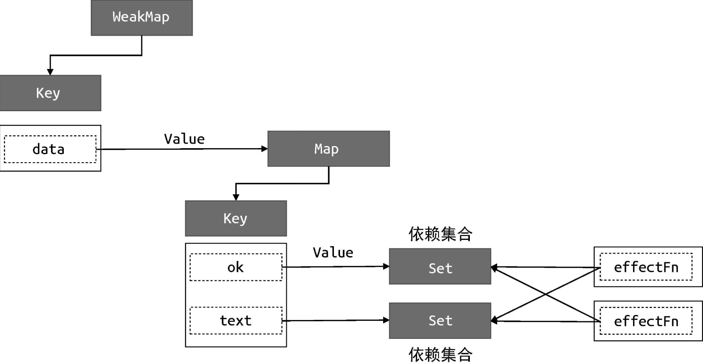

## 设计思路

### 声明式描述UI

::: render函数
@[code](./code/render.js)
:::

## 响应式系统

### 响应式原理Proxy
@[code](./code/响应式原理Proxy.js)

### 响应式数据简单实现
@[code](./code/响应式数据reactive.js)

### 响应式数据实现v2，带执行调度器 scheduler

引入cleanup，清除遗留的副作用依赖问题，例如存在三元表达式的响应式数据

引入 scheduler, 可操作trigger函数触发副作用函数的时机、次数和方式
@[code](./code/响应式数据cleanup.js)

### computed和lazy实现
@[code](./code/computed和lazy.js)

### watch实现
@[code](./code/watch实现.js)
watch本质时对 effect 的二次封装

#### watch的立即执行函数

@[code js](./code/watch的立即执行.mjs)
#### watch回调函数的执行时机

@[code js](./code/watch的执行时机.mjs)

#### 过期的副作用

在watch中，是异步请求的情况下，发送了请求A，还在等待中，修改wtch的变量，重新触发了请求B，

如果B请求先于A请求返回，会导致A的返回结果覆盖B的返回结果的情况。
@[code js{13-18,22-28,74-78}](./code/watch过期的副作用.mjs)
