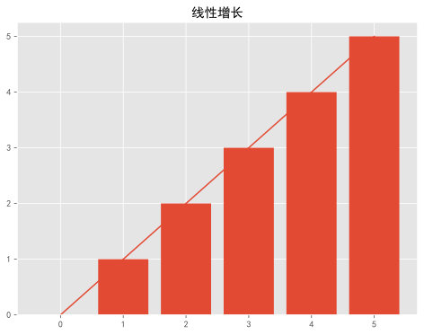

# 绘图

```python
%matplotlib inline
%config InlineBackend.figure_format = 'svg' # 设置矢量图，防止失真
```


```python
import pandas as pd
import matplotlib.pyplot as plt
import numpy as np

plt.rcParams['font.sans-serif'] = ['SimHei'] #指定默认字体
plt.rcParams['font.family']='sans-serif' #解决负号'-'显示为方块的问题
# 使用ggplot配色方案
plt.style.use('ggplot')
```


```python
# 创建画布，画图
fig = plt.figure(figsize=(8,6))
x = np.arange(6)
y = np.arange(6)
plt.plot(x,y)
plt.bar(x,y)
plt.title('线性增长')
```


    Text(0.5, 1.0, '线性增长')



